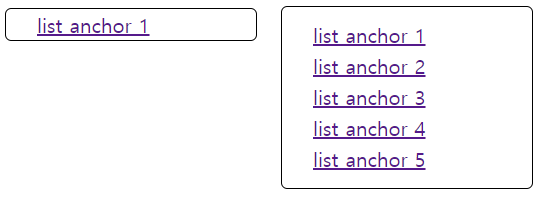
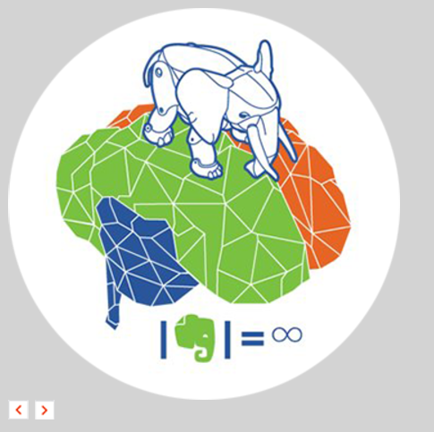
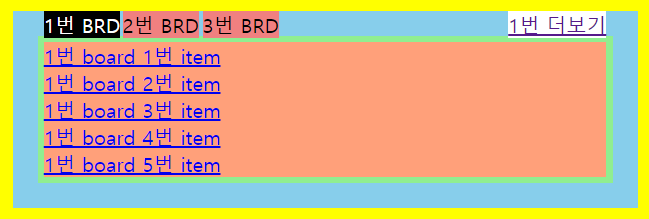
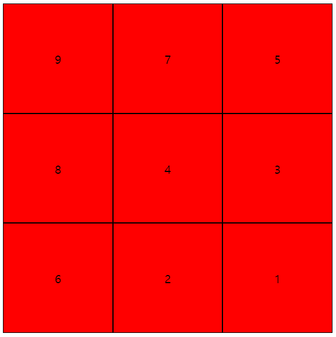
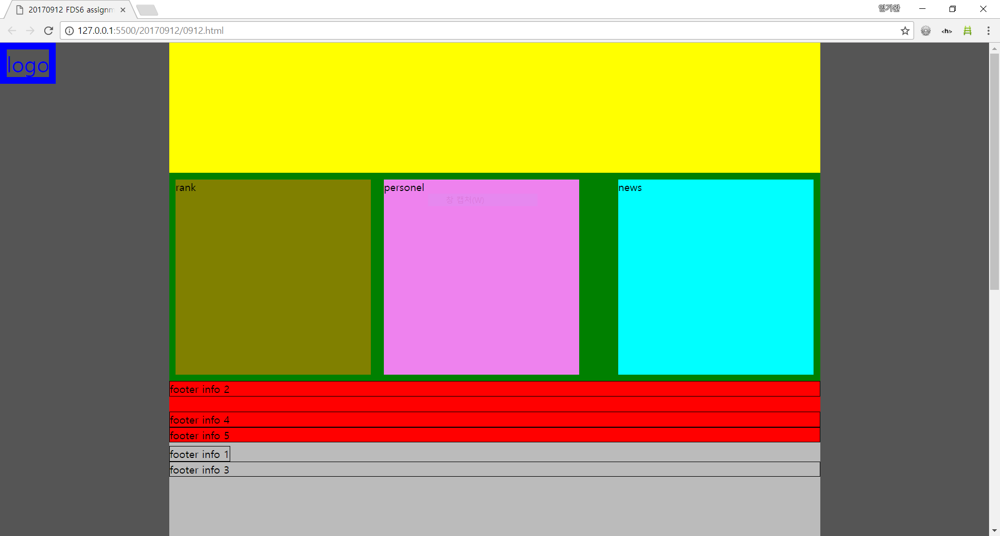
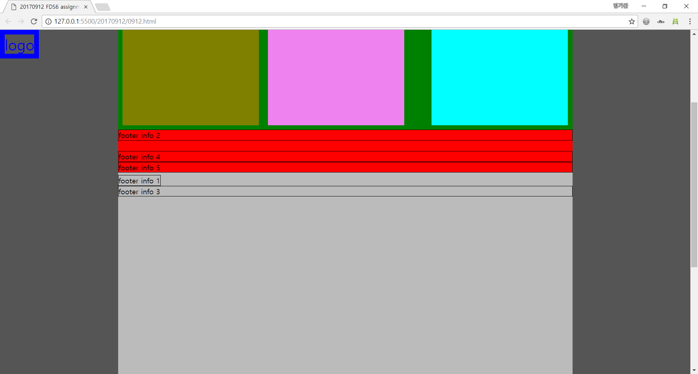

# FDS6_assign
FDS6기를 위한 과제 할당 repo

## 20170920 과제 설명

이 repository의 20170920 directory에 오늘의 과제가 들어있습니다.
20170920/0920.html와 20170920/0920.css 아래 조건에 맞춰 완성하시면 됩니다.

1. 위 그림 왼쪽 상자위에 mouse가 hover되면 오른쪽 상자처럼 변해야 함.
2. 변하는 과정이 부드럽게 애니메이션 될 것.
3. 위 그림 왼쪽 상자가 keyboard focus를 얻으면 오른쪽 상자처럼 변해야 함.
4. 변하는 과정이 부드럽게 애니메이션 될 것.
5. 모양과 색상, 링크 이름과 개수, 애니메이션 관련 설정 등은 완전 자유.

## 20170919 과제 해답

20170919A에 해답 파일 올려놨습니다.

## 20170919 과제 설명

이 repository의 20170919 directory에 오늘의 과제가 들어있습니다.
20170919/0919.html와 20170919/0919.css 아래 조건에 맞춰 완성하시면 됩니다.

1. h2 요소 내부의 text 요소를 제거하지 말것.
2. h2 요소를 위 그림의 코끼리 로고 그림으로 보이게 할것.
3. 첫번째 button 요소를 < 그림으로 보이게 할것.
4. 두번째 button 요소를 > 그림으로 보이게 할것.
5. 모든 그림의 소스는 20170919/img/sprite.png 하나만 사용할것.

## 20170918 과제 해답

20170918A에 해답 파일 올려놨습니다.

## 20170918 과제 설명

이 repository의 20170918 directory에 오늘의 과제가 들어있습니다.
20170918/0918.js와 20170918/0918.css 아래 조건에 맞춰 완성하시면 됩니다.

1. html 파일은 수정하지 말 것.
2. "x번 BRD"를 클릭 또는 tab이동으로 focus-in 하면 "x번 board 1번 item"~"x번 board 5번 item"이 위 그림과 같이 나타날 것
3. "x번 BRD"를 클릭 또는 tab이동으로 focus-in 하면 "x번 더보기"가 위 그림과 같이 나타날 것

그외에 너비, 길이, 색 등은 자유롭게 표현해 주시면 됩니다.

## 20170915 과제 해답

20170915A에 해답 파일 올려놨습니다.
더불어 해답 유도과정을 내일 아침 액티비티로 진행하겠습니다.

## 20170915 과제 설명

이 repository의 20170915 directory에 오늘의 과제가 들어있습니다.
20170915/0915.css 수정하여 아래 그림과 같이 만들어 주시면 됩니다.

제약사항은 아래와 같습니다.

1. position, flex구문을 추가 하지 말것.
2. html문서를 변경하지 말것.

힌트 keyword는 아래와 같습니다.

__**"음수 마진, nagative margin"**__

가급적 음수 마진에 대한 내용을 구글링해서 공부하시고 과제 시작해주세요.
월요일 아침 activity로 해법을 다룰 예정이니 개인적으로 다른 공부하실게 많으시다면 이 과제에 너무 많은 시간을 쏟지 마시기 바랍니다.

## 20170912, 20170913 과제 해답

20170912A, 20170913A directory에 해답 파일 올려놨습니다.
이 외의 방법이 있을 수도 있으니 참고삼아 보시면 되겠습니다.

## 20170913 과제 설명

이 repository의 20170913 directory에 오늘의 과제가 들어있습니다.
20170913/0913.html와 20170913/0913.css 아래 조건에 맞춰 완성하시면 됩니다.

1. 색상, 너비, 높이는 자유
2. 기본적으로 하위메뉴들은 보이지 않을것
3. 단 하위메뉴들이 보이지 않을 때에도 기계는 접근 가능해야함
4. 하위 메뉴들은 가로로 길게 한줄로 늘어 설 것
5. 하위 메뉴가 부모나 조상의 영역 밖으로 튀어나오지 않을 것.
6. 다음 상황에서 하위메뉴들이 보여질것
  1. 상위메뉴가 tab 이동을 통해 keyboard focus를 얻음
  2. 상위메뉴에 mouse가 hovering됨
7. 다음 상황에서 하위메뉴들이 다시 보이지 않게 될 것
  1. mark-up 순서상의 마지막 하위메뉴가 tab 이동을 통해 keyboard focus를 잃음
  2. 상위메뉴 또는 하위메뉴에서 mouse hovering을 잃음

## 20170912 과제 설명

이 repository의 20170912 directory에 오늘의 과제가 들어있습니다.
20170912/0912.html을 browser에서 열었을 때 아래 그림과 같이 보이도록 만드는 것이 오늘의 과제입니다.

두번째 그림은 왼쪽 상단의 파란색 "LOGO"가 scrolling에 상관 없이 항상 왼쪽 상단에 떠있음을 보이고 있습니다.

이 과제의 제약은 다음과 같습니다.

1. 0912.html의 mark-up 구조를 바꾸지 말아야함.
1. 0912.css에서 빠진 부분을 추가해야 함.

참고로 20170912.7z에는 이 과제의 해답 css 파일이 암호화되어 들어있습니다.
적절한 시기에 공개하도록 하겠습니다.